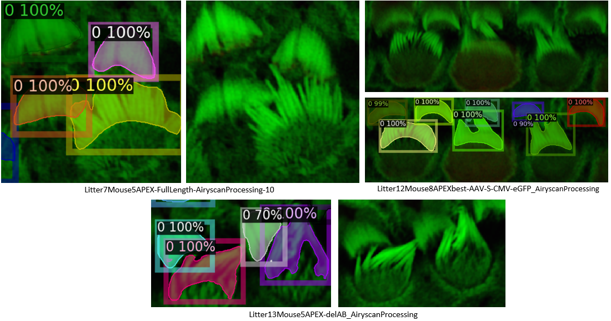

# VASCilia: A Revolutionary Napari Plugin for Cochlear StereoCilia Analysis
 
 Embark on a groundbreaking journey through the intricacies of the cochlea with VASCilia, the pioneering Napari plugin designed for the 3D segmentation and quantification of stereocilia bundles. Unveiling a suite of powerful features, VASCilia is a beacon of innovation for the auditory research realm, offering:

1. Selective Slice Discovery: Traverse the 3D landscape to pinpoint pivotal slices within your stack.
2. Stack Rotation: Align your perspective with precision for an optimal analytical viewpoint.
3. 3D Instance Segmentation with Multi-Object Assignment algorithm: Distinguish and analyze individual bundles with striking clarity.
4. Delete bundles: delete unwnated bundles.
6. Regional Bundle Categorization: Classify bundles distinctly as BASE, MIDDLE, or APEX regions.
7. IHC vs. OHC Identification: Accurately differentiate between Inner Hair Cells and Outer Hair Cells.
8. Comprehensive Measurement Computation: Determine volumes, centroids, surface areas, and more with precision.
9. Protein Intensity Quantification: Analyze the EPS8 protein with unrivaled accuracy.
10. 3D Distance Mapping: Chart the distance from peak to base for each bundle in three dimensions, tailored to your sample's resolution.

VASCilia stands as a treasure trove for the ear research community, heralding an era of simplicity and comprehensive measurements that resonate with the needs of laboratories worldwide. Alongside the plugin,  present a full-fledged collection of trained models for seamless 3D segmentation and region classification.

Moreover, we champion the advancement of knowledge by offering a dedicated training section. Whether you're delving into alternate staining methods or yearning to annotate, refine, and train new segmentation models.  

Join the vanguard of auditory research with VASCilia—where sophistication meets simplicity.

## How to install :  

conda create -y -n napari-VASCilia -c conda-forge python=3.10  
conda activate napari-VASCilia  
python -m pip install "napari[all]"  
pip install matplotlib  
pip install seaborn  
pip install opencv-python  
pip install czitools  
pip install scikit-learn  
pip install torch torchvision torchaudio  

Download the trained models from https://www.dropbox.com/scl/fo/xh40g5htgw6lnzxfaqf8f/h?rlkey=9di5nl7f1uq2v623cfc9gki7j&dl=0  
Change self.wsl_executable, self.model, self.model_region_prediction and self.model_output_path according to your path directory and the downloaded models  
Now you are ready to run: Run Napari_VASCilia_v1_1_0.py  :)  

## How to use VASCilia :  
There are many buttoms inside the blugin in the right hand side of Napari:

1. 'Open CZI Cochlea Files and Preprocess' buttom: read the CZI file.
2. 'Upload Processed CZI Stack' buttom: Incase you already have processed the stack, then just uplead your Analysis_state.pkl that usually has all the variables needed to upload your analysis
3. 'Trim Full Stack' buttom: this buttom allows you to choose only the slices of interest (will be automated in the near future)
4. "Rotate' buttom: this buttom allows to rotate the stack to have proper analysis 
5. Segment with 3DCiliaSeg: 3DCiliaSeg is two steps algorithm (2D detection + multi-object assignment algorithm across all slices) to produce robust 3D detection. 3DCiliaSeg is the first instance segmentation model for stereocilia bundles in the literature. It is trained on 46 stacks and it produce highly acccurate boundary delineation even in the most challenging datasets. Here are some examples:  

Stereocilia bundles detection for one frame(slice) of the stack

Multi-object assignment algorithm to produce robust 3D detection

3DCiliaSeg can tackles challenged cases

7. Delete Label 'buttom': delete the unwanted detection if it is near the boundary or for any other reason.
8. Calculate measurments 'buttom': calculate different measurments from the detected bundles and store them in csv file
9. Calculate Distance 'buttom': compute the 3D distance from the highest point in the 3D detection of each bundle to it's base. This calculation will consider the sample resolution.
10. Perform Cell Clustering 'buttom': find the IHC, OHC1, OHC2, and OHC3 using either GMM or Kmeans. Those layers will be added to the plugin to be used during the analysis 
11. Compute Protein Intensity 'buttom': produce plots and CSV files that has the accumelated intensity and mean intensity for the protein signal (here it is eps8 protein) 

### Project Authors and Contacts

**Python Implementation of this repository:** Dr. Yasmin M. Kassim    
**Contact:** ykassim@ucsd.edu

**Stacks used in this study imaged by:** Dr. David Rosenberg   
**Contact:** d2rosenberg@UCSD.EDU

Five undergraduate students participated in annotating the manual ground truth using CVAT annotation tool: Zhuoling Huang, Samia Rahman, Ibraheem Al Shammaa, Samer Salim, and Kevin Huang 

**Lab Supervisor:** Dr. Uri Manor   
**Contact:** u1manor@UCSD.EDU  
**Department:** Cell and Development Biology Department/ UCSD  
**Lab Website:** https://manorlab.ucsd.edu/

